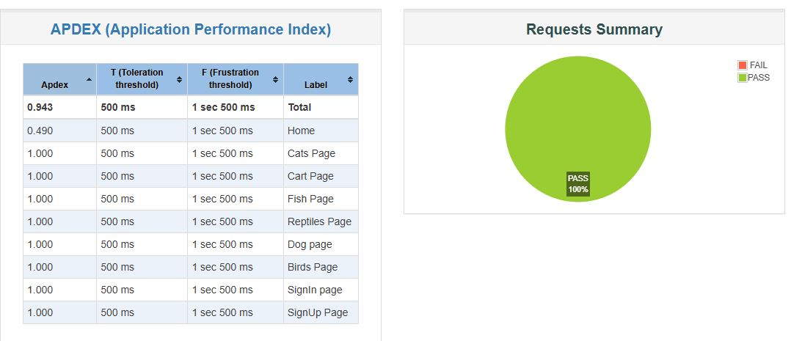
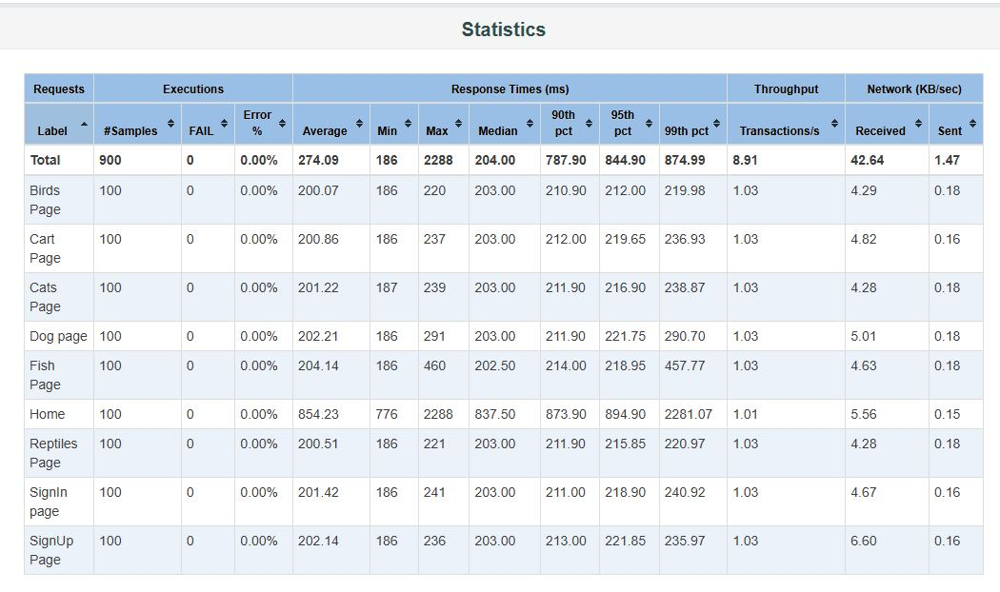
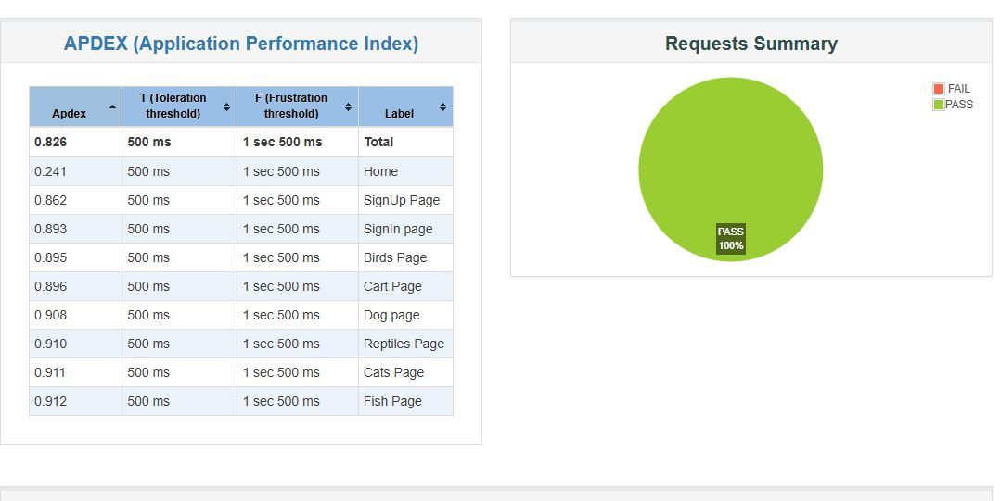
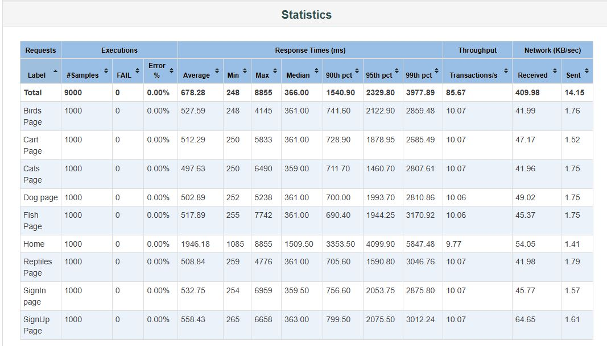
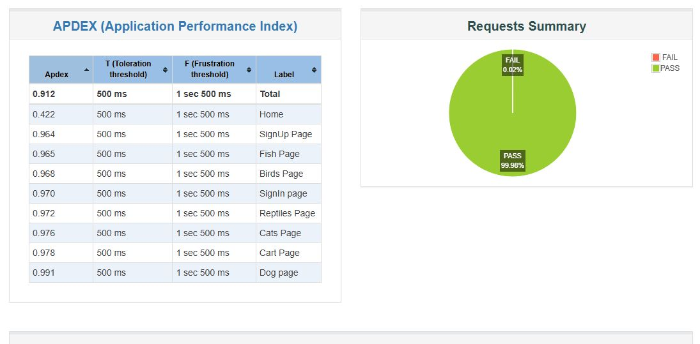
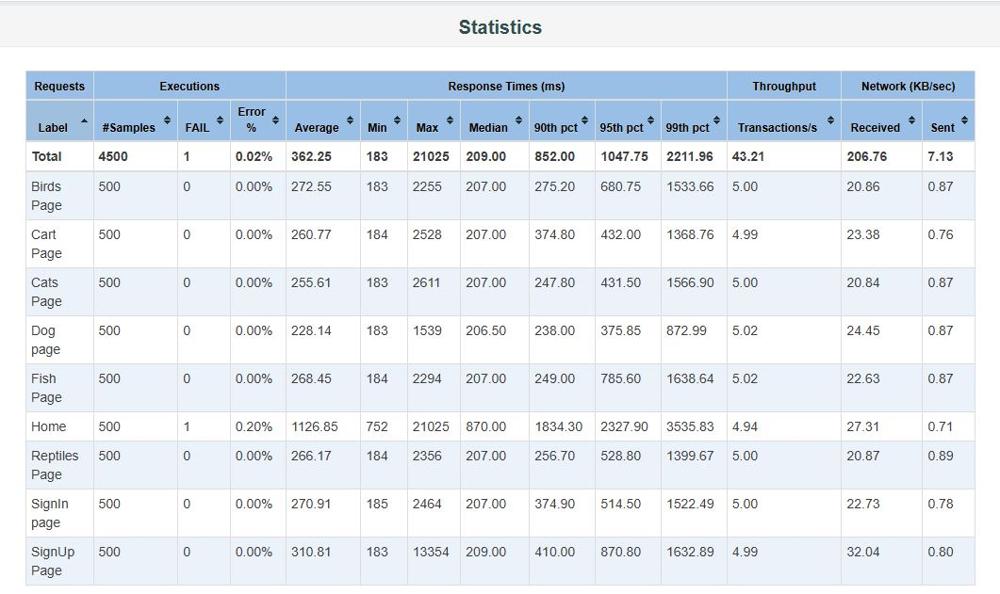

📘 JMeter Load Testing on Pet Store Demo Web Application 
This repository contains the performance and load testing project executed on the Pet Store Demo Web Application using Apache JMeter. 
The goal of this project was to analyze how the application behaves under different user loads and measure its performance metrics across multiple critical pages. 

📌 Test Objective 
To evaluate the performance, stability, and responsiveness of the Pet Store demo website under varying user loads by executing multiple load test scenarios on key application pages. 

🧪 Test Scope 

A total of 9 web pages from the Pet Store application were tested: 
🏠 Home
👤 Sign In
📝 Sign Up
🛒 Cart
🐠 Fish Category
🐶 Dogs Category
🐱 Cats Category
🦎 Reptiles Category
🐦 Birds Category

🚀 Load Test Scenarios

Three separate load test runs were performed using different virtual user loads: 
1️⃣ Test Run – 100 Users 
Thread Group Users: 100 
Ramp-Up Period: 100 seconds 
Collected .jtl and .csv result files 

2️⃣ Test Run – 500 Users 
Thread Group Users: 500 
Ramp-Up Period: 100 seconds 
Collected .jtl and .csv result files  

3️⃣ Test Run – 1000 Users 
Thread Group Users: 1000 
Ramp-Up Period: 100 seconds 
Collected .jtl and .csv result files  

📂 Repository Contents
This repository includes:
<ul>
<li>JMeter Test Plan (.jmx)</li>
<li>Raw test result files: .jtl files, .csv files </li>
<li>HTML report screenshots</li>
<li>Response times</li>
<li>Throughput graphs</li>
<li>Summary reports</li>
<li>Transaction performance</li>
<li>Documentation files</li>
<li>README.md</li>
</ul>

📊 Performance Metrics Observed

The following performance indicators were captured:
<ul>
  <li>⏱ Average Response Time</li>
  <li>⚡ Throughput (Requests/sec)</li>
  <li>📈 95th & 99th Percentile Response Time</li>
  <li>📉 Error Percentage</li>
  <li>🔁 Transaction Success/Failure Rate</li>
  <li>🕒 Server Response Distribution</li>
</ul>

🛠 Tools & Technologies Used
<ul>
  <li>Apache JMeter 5.3</li>
  <li>Java</li>
  <li>CSV/JTL Result Parsing</li>
  <li>GitHub for version control</li>
  <li>HTML Report Dashboard</li>
</ul>

▶️ How to Run the Test

=>  Install Apache JMeter 
=>  Clone this repository:  git clone https://github.com/your-username/your-repo-name.git 
=>  Open JMeter → Load the .jmx test plan 
=>  Modify Thread Group (optional) 

**  Run tests in GUI or Non-GUI mode: 
=>  jmeter -n -t TestPlan.jmx -l results.jtl 

**  Generate HTML Report: 
=>  jmeter -g results.jtl -o HTMLReport 

🎯 Conclusion

This load-testing project demonstrates how the Pet Store application performs under gradual user load increments from 100 → 500 → 1000 users. 
All raw data, reports, and screenshots are available in this repository for analysis and future reference.
  
